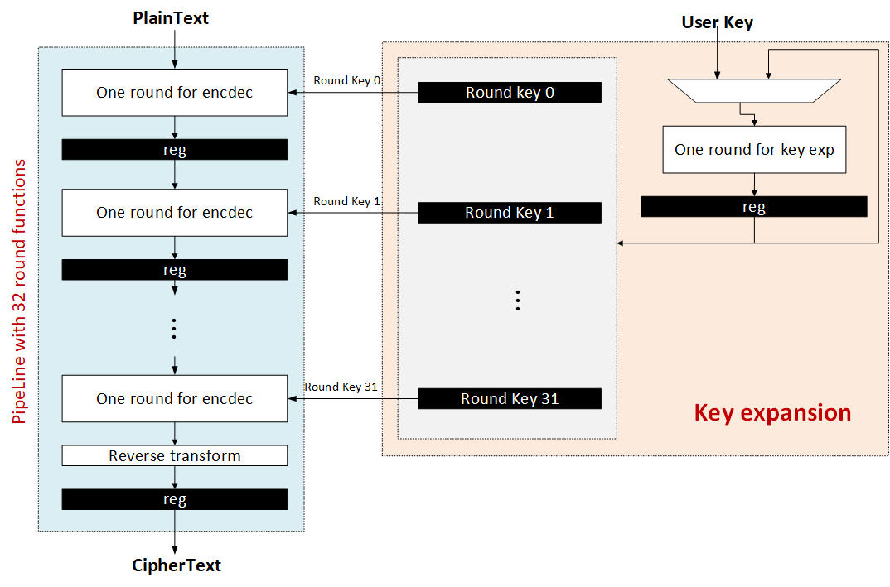
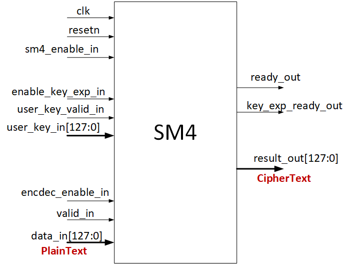
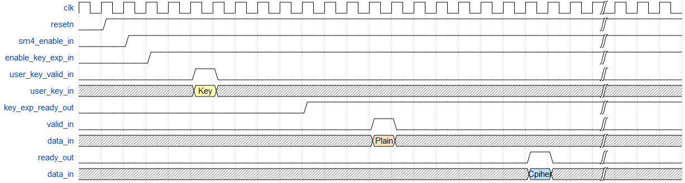

# FPGA implementation of Chinese SM4 encryption algorithm.

## Introduction

This core is an implementation of  Chinese SM4 (also known as sms4) encryption algorithm. 

## Architecture



## Interface



| Interface         | direction | width   | description                       |
| ----------------- | --------- | ------- | --------------------------------- |
| clk               | in        | 1-bit   | clock signal                      |
| resetn            | in        | 1-bit   | reset signal, 0 reset             |
| sm4_enable_in     | in        | 1-bit   | enable sm4 core to work           |
| enable_key_exp_in | in        | 1-bit   | enable key expansion for sm4      |
| user_key_valid_in | in        | 1-bit   | valid signal of user key          |
| user_key_in       | in        | 128-bit | 128-bit user key                  |
| encdec_enable_in  | in        | 1-bit   | enable encryption to work         |
| valid_in          | in        | 1-bit   | valid signal of plain text        |
| data_in           | in        | 128-bit | plain text, 128-bit, 16 Bytes     |
| key_exp_ready_out | out       | 1-bit   | ready signal of key expansion     |
| ready_out         | out       | 1-bit   | ready signal of encryption result |
| result_out        | out       | 128-bit | encryption result                 |


## Timing


> Timing diagram is edited by [WaveDrom](https://github.com/drom/wavedrom/releases)

```
{signal: [
  {name: 'clk',    				wave: 'p......................|...'},
  {name: 'resetn', 				wave: '01.....................|...'},
  {name: 'sm4_enable_in', 		wave: '0.1....................|...'},
  {name: 'enable_key_exp_in', 	wave: '0..1...................|...'},
  {name: 'user_key_valid_in', 	wave: '0....10................|...'},
  {name: 'user_key_in',			wave: 'x....3x................|...',data:["Key"]},
  {name: 'key_exp_ready_out',   wave: '0.........1............|...'},
  {name: 'valid_in', 			wave: '0............10........|...'},
  {name: 'data_in', 			wave: 'x............4x........|...', data:["Plain"]},
  {name: 'ready_out', 			wave: '0...................10.|...'},
  {name: 'data_in', 			wave: 'x...................5x.|...', data:["Cpiher"]},   
],
   config : { "hscale" : 1 }
}
```

